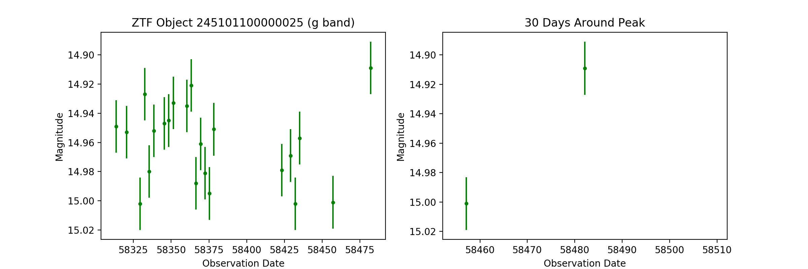

# zort : ZTF Object Reader Tool

## Getting Started

The ZTF Object Reader Tool, ```zort```, is set of functions to organize and 
access the ZTF Public Data Release lightcurves across multiple colors. 

### ZTF Public Data Release Lightcurves

Instructions for downloading and extracting ZTF Public Data Release Lightcurves 
can be found at: https://www.ztf.caltech.edu/page/dr1#12c

The ZTF Public Data Release Lightcurves are generated through spatially 
cross-matching individual epoch photometric catalogs. Catalogs are 
pre-filtered to be (1) the same ZTF observation field ID, (2) the same CCD 
readout channel, and (3) the same photometric color. Spatially coincidence
observations in these catalogs are all labelled as objects and saved to a 
common ascii file along with the observation data for each epoch of the object. 
These files are consolidated such that all objects sharing a common ZTF 
observation field ID reside in the same file.

```zort``` refers to these files with extension ```*.txt``` as 
**lightcurve files**.

### Features

```zort``` provides facilitates the reading and inspection of lightcurves in 
the ZTF Public Data Release. The features of ```zort``` include:
- Seamless looping through ZTF lightcurves for custom filtering, where 
interesting objects can be saved and recovered by only their file location
- Consolidating g-band and R-band lightcurves of a single source that are 
otherwise labelled as two separate objects by pairing objects as "siblings"
- Plotting lightcurves in multiple colors for visual inspection

### Installation

Preferred method is through pip:

```
pip install zort
```

Latest version can also be installed from github:
```
git clone https://github.com/MichaelMedford/zort.git
cd zort
python setup.py install
```

### Terminology
- **lightcurve file**: Files included in the ZTF Public Data Release containing 
epoch photometry for spatially coincidence observations
- **object**: A collection of spatially coincident 
observations in a single color. Objects include IDs, sky locations (in right 
ascension and declination) and colors (g-band and R-band).
- **lightcurve**: Observation epochs of an object. Lightcurve observations 
include dates, magnitudes and magnitude errors.
- **rcid map**: Information on the organization of the lightcurve files 
required for faster object access.
- **sibling**: A spatially coincident source in a different color.

### Initialization

```zort``` requires that the location of the lightcurve files be saved as 
an environemnt variable **ZTF_LC_DATA**. You will most likely want to set this 
location as an environment variable in your ~/.bashrc file or ~/.cshrc.

```zort``` creates two additional data products per lightcurve file 
(```*.txt```) in order to make object discovery and multiple color 
consolidation faster. Object files (```*.objects```) contain all of the 
metadata for each object in a lightcurve file. RCID map files 
(```*.rcid_map```) contain lightcurve file metadata that facilitates faster 
matching of multiple colors for individual objects. ```zort``` requires that 
each lightcurve file has a corresponding object file and RCID map file.

To generate object files and RCID map files either run:
```
python {initializeFile}
```
or
```
python {initializeFile} --parallel --n-procs=$N_PROCS
``` 

## Examples

### Extracting Lightcurves

```zort``` is designed to provide you with easy access to all of the 
lightcurves in a lightcurve file for applying filters and saving interesting 
objects. The preferred method for inspecting lightcurves is through a for-loop.

A filter is created that returns True for interesting objects. This filter 
can involve simply cuts on object properties or complicated model fitting to 
the full observation data in the object's lightcurve
```
def my_interesting_filter(obj):
    cond1 = obj.nepochs >= 20
    cond2 = min(obj.lightcurve.mag) <= 17.0
    if cond1 and cond2:
        return True
    else:
        return False
```

When a lightcurve file is looped over, it returns each object in the lightcurve
file. The buffer_position should be saved for interesting objects as this is 
the unique identifier for each object. Saving this identifier, instead of the 
object ID, allows for O(1) retrieval of the lightcurve.
```
filename = 'field000245_ra357.03053to5.26702_dec-27.96964to-20.4773.txt'
interesting_objects = []

from zort.lightcurveFile import LightcurveFile
for obj in LightcurveFile(filename):
    if my_interesting_filter(obj):
        interesting_objects.append(obj.buffer_position)
```

Objects and their lightcurves can be retrieved by instantiating an Object with 
the lightcurve filename and the object's buffer_position.
```
from zort.object import Object
for buffer_position in interesting_objects:
    obj = Object(filename, buffer_position)
    print(obj)
    print(obj.lightcurve)
``` 

### Matching multiple  colors for an object

Each object is defined as a spatially coincidence series of observations that 
share a (1) ZTF observation field ID, (2) CCD readout channel, and (3) 
photometric filter. This labels multiple colors of the same astrophysical 
source as separate ZTF objects with separate object IDs. The ZTF Public Data 
Release does not provide any native support for pairing these objects as 
multiple colors of the same source.

```zort``` supports searching for and saving multiple colors for the same 
source. The ZTF Public Data Release contains observations in g-band 
(filterid=1) and R-band (filterid=2). Each object can therefore have one 
additional object that comes from the same astrophysical source but is in a 
different color. These matching objects are labelled as "siblings" and can 
be both discovered and saved with ```zort```.

The sibling for each object can be located by simply running an object's  
```locate_sibling``` method. Running

```
filename = 'field000245_ra357.03053to5.26702_dec-27.96964to-20.4773.txt'
buffer_position = 6852
obj = Object(filename, buffer_position)
obj.locate_sibling()
```

results in
```
Locating sibling for ZTF Object 245101100000025
-- Object location: 4.74852, -26.23583 ...
** sibling file missing! **
-- Searching between buffers 17749819 and 18135260
---- Sibling found at 4.74851, -26.23581 !
---- Original Color: 1 | Sibling Color: 2
---- Sibling saved
```  

The sibling is saved in a **.siblings** file that can be later recalled. This 
was the first time that a sibling was located for this lightcurve file and 
therefore a new sibling file was generated. Now that the sibling has been 
located, running

```
obj.locate_sibling()
```

results in
```
Locating sibling for ZTF Object 245101100000025
-- Object location: 4.74852, -26.23583 ...
-- Loading sibling...
-- Sibling loaded!
```  

An object's sibling is itself another object and can be accessed through the 
sibling attribute.

```
print(obj)
Filename: field000245_ra357.03053to5.26702_dec-27.96964to-20.4773.txt
Buffer Position: 6852
Object ID: 245101100000025
Color: g
Ra/Dec: (4.74852, -26.23583)
22 Epochs passing quality cuts

print(obj.sibling)
Filename: field000245_ra357.03053to5.26702_dec-27.96964to-20.4773.txt
Buffer Position: 126136890
Object ID: 245201100000047
Color: r
Ra/Dec: (4.74851, -26.23581)
22 Epochs passing quality cuts
```

The default tolerance for matching two objecs as siblings is is 2.0". However 
this can be altered by changing ```obj.sibling_tol_as``` prior to runnning
```obj.locate_sibling()``` for the first time.

Siblings are saved to and read from sibling files using the ```portalocker``` 
package, locking sibling files from simultaneous reading and writing. This 
guarantees that sibling files will not become corrupted if multiple parallel 
processes are attempting to save siblings to a sibling file simultaneously.  

### Plotting lightcurves

A lightcurve plot can be generated for any object using the 
```obj.plot_lightcurve()``` method.


A lightcurve plot including an object's sibling 
cand be generated using the ```obj.plot_lightcurves()``` method.


## Requirements
* Python 3.6

## Authors
* Michael Medford <MichaelMedford@berkeley.edu>
